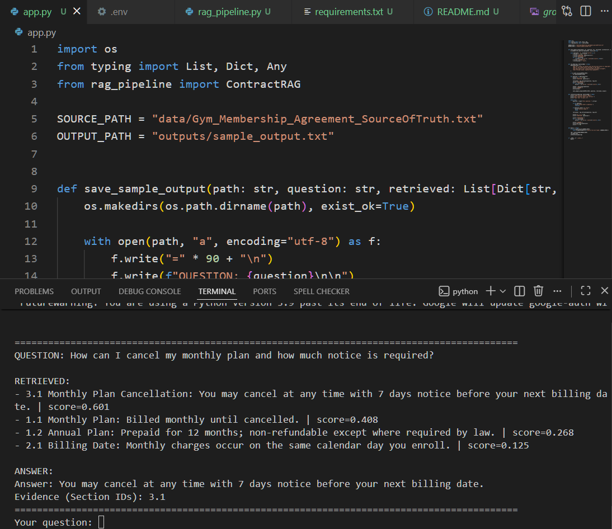
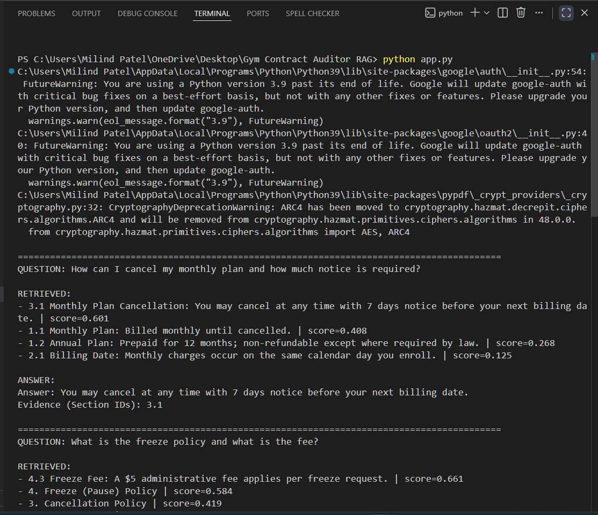
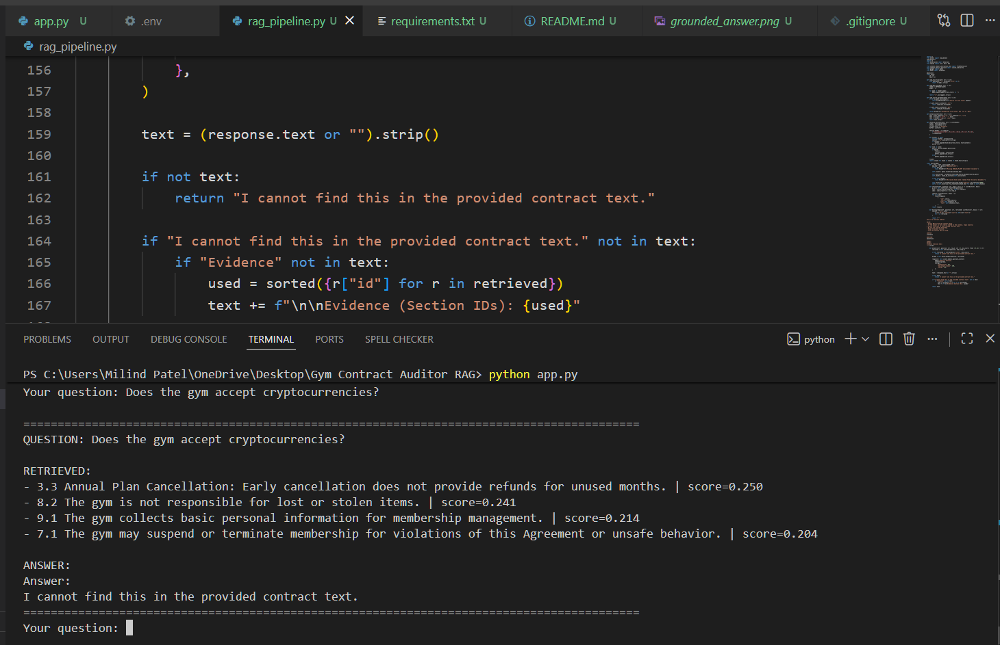

# Gym Contract Auditor: Retrieval Augmented Generation (RAG)

A Python-based Retrieval-Augmented Generation (RAG) system that answers questions from a gym membership agreement using grounded document retrieval instead of hallucinated responses.
This project demonstrates how classical NLP retrieval (TF-IDF + cosine similarity) can be combined with a Large Language Model (Gemini) to build a trustworthy contract question-answering assistant.

## Project Objective

Most LLM demos generate answers directly and risk hallucinating information.
This system improves reliability by:
- retrieving relevant contract sections first
- restricting the model to retrieved context only
- refusing answers when evidence is missing
- citing section references used for responses
This mirrors how enterprise document-assistant systems operate.

## Features

- Supports .txt and .pdf contract ingestion
- Section-aware document chunking
- TF-IDF similarity retrieval
- Cosine similarity ranking
- Grounded Gemini responses
- Hallucination-resistant fallback logic
- Evidence-based section citations
- Interactive command-line interface
- Sample output logging

---

## Example Outputs

### Retrieval Example


---

### Grounded Answer Example



---

### Hallucination Prevention Example


---

### Example Query

Input:
```
How can I cancel my monthly plan and how much notice is required?
```
Output:
```
Cancellation requires 7 days notice before the next billing date.
Evidence: Section 3.1
```
### Unsupported query Example
Input: 
```
Does the gym accept cryptocurrencies?
```
Output:
```
I cannot find this in the provided contract text.
```

## Architecture Overview
```
Pipeline Workflow:
User Question
      ↓
TF-IDF Vectorization
      ↓
Cosine Similarity Search
      ↓
Top Matching Contract Sections
      ↓
Prompt Construction
      ↓
Gemini Grounded Response
      ↓
Answer + Evidence Sections
```

## Technologies Used

- Python
- Scikit-learn (TF-IDF Retrieval)
- Cosine Similarity
- Google Gemini API
- PyPDF (PDF ingestion)
- Regex-based section chunking

## Repository Structure
```
Gym_Contract_Auditor_RAG/
│
├── app.py
├── rag_pipeline.py
├── requirements.txt
│
├── data/
│   └── Gym_Membership_Agreement_SourceOfTruth.txt
│
├── examples/
│   └── sample_questions.txt
│
├── outputs/
│   └── sample_output.txt
│
├── screenshots/
│
└── README.md
```

## Installation
Clone repository:
```
git clone https://github.com/milindpat/gym-contract-auditor-rag.git
cd gym-contract-auditor-rag
```
Install dependencies:
```
python -m pip install -r requirements.txt
```
## Environment Setup

Create .env file in project root:
```
GOOGLE_API_KEY=your_api_key_here
```
## Running the Project
Run demo mode:
```
python app.py
```
The script:
- executes sample contract questions
- prints retrieved sections
- generates grounded answers
- saves output to:
```
outputs/sample_output.txt
```
Interactive mode starts automatically afterward.
Example:
```
Ask a question about the contract.
Type 'exit' to quit.
```

## Evaluation Strategy

This system was evaluated using representative contract queries covering:

- membership cancellation rules
- freeze policy eligibility
- guest access permissions
- unsupported payment edge cases

The assistant correctly returns grounded answers when evidence exists and refuses responses when information is absent, demonstrating hallucination-resistant behavior.

## Limitations

Current version:

- Uses TF-IDF instead of embeddings
- Processes single-document inputs
- Assumes structured section formatting
- Does not persist vector indexes

## Future Improvements

Planned enhancements:

- Embedding-based semantic retrieval
- FAISS vector indexing
- Multi-document contract search
- Evaluation dataset integration
- Streamlit web interface deployment

## Author

Milind Patel  
Computer Information Technology (Cloud Computing Focus)  
William Paterson University  

LinkedIn: https://linkedin.com/in/milind-patel-903094383  
GitHub: https://github.com/milindpat